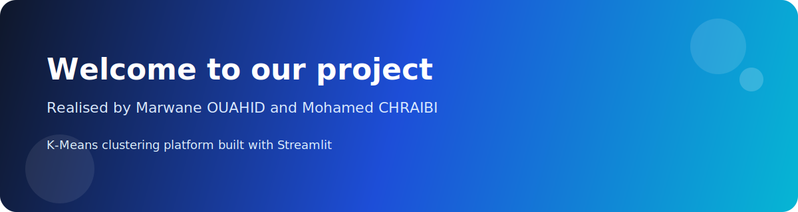

# TP-Kmeans

<p align="center">
  
</p>

<p align="center"><strong>Welcome to our project</strong><br>Realised by <strong>Marwane OUAHID</strong> and <strong>Mohamed CHRAIBI</strong></p>

Application interactive de **clustering K-Means** développée avec **Streamlit** pour explorer des fichiers CSV, analyser les données et visualiser des groupes automatiquement.

🔗 **Dépôt GitHub :** [https://github.com/chraibimo/TP-Kmeans](https://github.com/chraibimo/TP-Kmeans)

---

## 📌 Objectif du projet

Cette application permet de :

- importer un ou plusieurs fichiers CSV,
- explorer rapidement les données chargées,
- analyser la fréquence d'une colonne (`age`, `ville`, `genre`, etc.),
- filtrer les données avant traitement,
- appliquer l'algorithme **K-Means** sur des variables numériques,
- visualiser les clusters obtenus.

---

## ⚙️ Prérequis

Avant de lancer le projet, assurez-vous d'avoir installé :

- **Python 3.10+**
- `pip`

---

## 🚀 Installation

Clonez le dépôt puis installez les dépendances :

```powershell
git clone https://github.com/chraibimo/TP-Kmeans.git
cd TP-Kmeans
pip install -r requirements.txt
```

---

## ▶️ Lancer l'application

Depuis le dossier du projet, exécutez :

```powershell
streamlit run app.py
```

Ensuite, ouvrez automatiquement ou manuellement l'adresse suivante dans votre navigateur :

```text
http://localhost:8501
```

---

## 🧑‍💻 Comment utiliser le projet

### 1. Importer les fichiers CSV
- Utilisez la barre latérale pour importer un ou plusieurs fichiers.
- Choisissez le séparateur (`Auto`, `,`, `;`, `Tab`, `|`) si nécessaire.

### 2. Sélectionner les données à analyser
- Si plusieurs fichiers sont chargés, vous pouvez :
  - analyser **tous les fichiers**, ou
  - choisir **un fichier précis**.

### 3. Explorer les données
- Visualisez un aperçu du tableau.
- Consultez le nombre de lignes, de colonnes et de variables numériques détectées.

### 4. Appliquer des filtres
- Sélectionnez une colonne avec peu de valeurs distinctes.
- Gardez uniquement les valeurs qui vous intéressent avant l'analyse.

### 5. Faire une analyse de fréquence
- Choisissez une colonne comme `age`, `ville` ou `profession`.
- L'application affiche automatiquement un histogramme ou un graphique adapté.

### 6. Lancer le clustering K-Means
- Sélectionnez au moins **deux colonnes numériques**.
- Choisissez le nombre de clusters `K`.
- Activez ou non la normalisation des variables.
- L'application calcule ensuite les groupes et affiche les résultats.

---

## ✨ Fonctionnalités principales

- Import de plusieurs fichiers CSV
- Détection automatique de colonnes numériques
- Prévisualisation des données
- Filtres interactifs
- Analyse de fréquence
- Clustering **K-Means**
- Visualisation des clusters
- Interface simple avec **Streamlit**

---

## 📁 Structure du projet

```text
TP-Kmeans/
├── app.py
├── requirements.txt
└── README.md
```

---

## 🛠️ Technologies utilisées

- **Streamlit**
- **Pandas**
- **NumPy**
- **Scikit-learn**
- **Plotly**

---

## 👤 Auteur

Projet disponible sur GitHub : [chraibimo/TP-Kmeans](https://github.com/chraibimo/TP-Kmeans)
